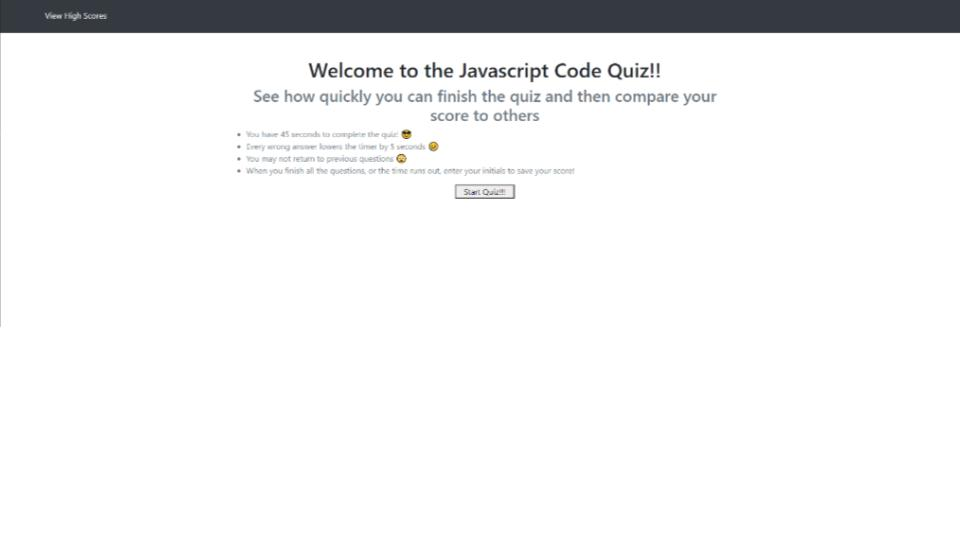

# Challenge04
 Javascript interactive quiz

## What it does...
It's a quiz on programming and javascript with a timer and high score records.
Every time you get a question right you score points. When you get a question wrong, you get no points and time is removed from the timer. Once the timer reaches 0, your score and initials can be logged and displayed along with other quiz takers scores.

[Java Quiz Website](https://lincolnw90.github.io/Challenge04/)